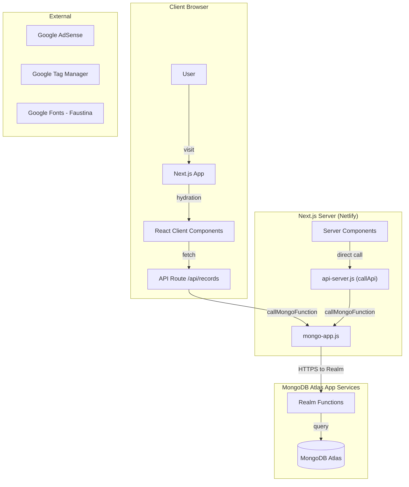
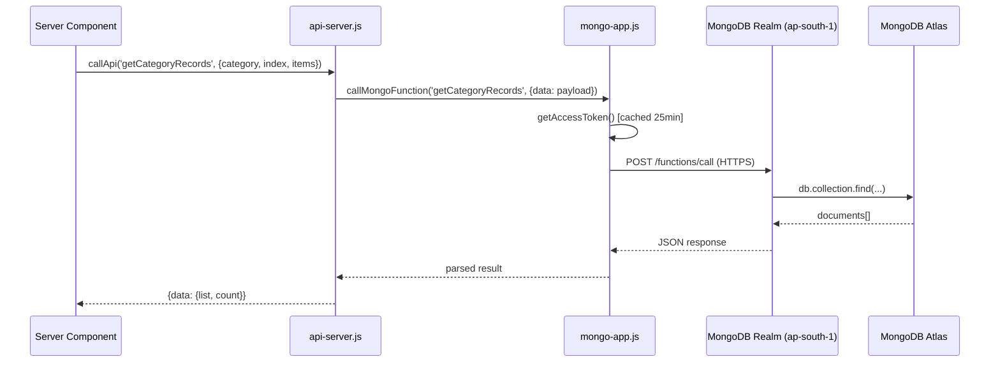

# 🔍 NewSarkariResult — Deep Project Analysis & Optimization Plan

> **Project**: [newsarkariresult.co.in](https://newsarkariresult.co.in) — a clone of sarkariresult.com built with **Next.js 15 + React 19**  
> **Goal**: Lightning-speed performance, millions-of-users scalability, seamless Google Ads, best-in-class SEO  

---

## 1. Architecture Overview



### Key Architectural Decisions
| Aspect | Current Approach |
|---|---|
| **Framework** | Next.js 15.3.4 + React 19 (App Router) |
| **Styling** | Tailwind CSS 4 |
| **Database** | MongoDB Atlas via **Realm App Services** (serverless functions) |
| **Hosting** | Netlify (`@netlify/plugin-nextjs`) |
| **Auth** | API Key → JWT token (25-min cache in-memory) |
| **Caching** | ISR with `revalidate: 30` on detail pages; no edge/CDN caching strategy |
| **Ads** | Google AdSense Auto Ads (delayed 3s load) |
| **SEO** | `next-sitemap`, structured data (Article, JobPosting, FAQPage, BreadcrumbList) |
| **Images** | `next/image` with imgbb remote patterns |

---

## 2. Component & Page Map

### Pages (18 routes)

| Route | Type | Data Source | Notes |
|---|---|---|---|
| `/` (home) | Server | `getCategoryRecords` (upcoming, 10 items) | Dynamic imports for `LatestUpdates`, `CategoryColumns`, `SearchSection` |
| `/[slug]` | Server + ISR(30s) | `getRecordDetails` via `react.cache` | `generateStaticParams` pre-renders all slugs at build |
| `/latest-jobs` | Server | `ListingTable` (100 items) | Static metadata |
| `/sarkari-result` | Server | Static `categoryData` | No API call on page load |
| `/sarkari-result/[category]` | Server | `getFilteredRecords` (50 items) | `generateStaticParams` for all filter keys (~60 pages) |
| `/result`, `/admit-cards`, `/answer-key`, `/syllabus`, `/admission`, `/documents`, `/offline-form`, `/sarkari-yojna`, `/upcoming` | Server | `ListingTable` component | Category listing pages |
| `/admin/manage` | Client | CRUD via `api.js` | Admin dashboard |
| `/about`, `/contact`, `/disclaimer`, `/privacy-policy` | Server | Static content | Info pages |

### 🚨 Home Page: The Waterfall Problem

The home page makes **12+ sequential/parallel Realm API calls** on every request:

1. `getCategoryRecords` (upcoming) — in `page.jsx`
2. `getLatestImportantRecords` — in `LatestUpdates` (async server component)
3. **10× `getCategoryRecords`** — in `CategoryColumns` (each `ListingTable` makes its own call for: result, latest-jobs, admit-cards, answer-key, syllabus, admission, documents, offline-form, sarkari-yojna, upcoming)

> [!CAUTION]
> **This is the #1 performance bottleneck.** Each API call goes through: `Next.js server → HTTPS to MongoDB Realm (ap-south-1) → Realm Function → MongoDB Atlas query → response`. With 12+ round-trips, TTFB can easily exceed 3-5 seconds.

---

## 3. Data Layer & Database Analysis

### How Data Flows



### Database Issues & Recommendations

| # | Issue | Severity | Fix |
|---|---|---|---|
| **DB-1** | **No aggregation pipeline** — All listing queries fetch full documents when only `title`, `title_slug`, and `show` fields are needed | 🔴 Critical | Use MongoDB **projection** (`{title: 1, title_slug: 1, show: 1}`) in Realm functions to reduce payload size by ~90% |
| **DB-2** | **No indexes visible** — Cannot verify from frontend, but the Realm functions likely query by `category`, `title_slug`, `filters`, and `pendingForm` fields | 🔴 Critical | Ensure compound indexes exist: `{category: 1, inserted: -1}`, `{title_slug: 1}` (unique), `{filters.exam_type: 1}`, `{pendingForm: 1}` |
| **DB-3** | **Token caching is per-instance** — `cachedToken` is a module-level variable; on serverless (Netlify), each cold start gets a new process, meaning frequent re-authentication | 🟡 Medium | Acceptable for now, but consider storing the token in a KV store or using the MongoDB Data API instead of Realm App Services |
| **DB-4** | **No pagination optimization** — `index`/`items` params suggest skip-based pagination which is O(n) in MongoDB | 🟡 Medium | Switch to cursor-based pagination using `{_id: {$gt: lastId}}` for large datasets |
| **DB-5** | **Draft system creates duplicates** — "Save Draft" calls `addRecord` with `pendingForm: true`, creating a new document instead of updating in-place | 🟡 Medium | Use `updateRecord` with a `status: 'draft'` field instead of creating new documents |
| **DB-6** | **107KB `categoryData.js` ships to client** — This massive static file with SEO content for 60+ categories is imported in server components but its size bloats the build | 🟢 Low | Already server-only since it's used in server components; verify it's not in the client bundle via `next build --analyze` |

---

## 4. Performance Bottlenecks (13 Issues)

### 🔴 Critical (Causes visible slowness)

| # | Issue | Where | Impact |
|---|---|---|---|
| **P-1** | **12+ Realm API calls on home page** | `page.jsx` → `CategoryColumns` → `ListingTable` | TTFB 3-5s+, every uncached visit hammers Realm |
| **P-2** | **No data-fetching consolidation** | Each `ListingTable` is an independent async server component making its own API call | Realm rate limiting risk, serial waterfall potential |
| **P-3** | **`revalidate: 30` on detail pages** | `[slug]/page.jsx` — line 17 | For a content site updated a few times/day, 30s ISR causes unnecessary revalidation. Should be 300-600s minimum |
| **P-4** | **No ISR/caching on home page** | `page.jsx` has no `revalidate` export | Every visit triggers fresh data fetching from Realm |
| **P-5** | **`revalidate: 30` on `callMongoFunction`** | `mongo-app.js` line 49 | This fetch-level revalidation conflicts with page-level ISR and causes confusion |

### 🟡 Medium (Noticeable impact)

| # | Issue | Where | Impact |
|---|---|---|---|
| **P-6** | **Header is `'use client'`** | `Header.jsx` line 1 | Forces client-side hydration of the entire header; should be a server component (it has no interactivity) |
| **P-7** | **`UpcomingScroller` prevents scroll** | `useEffect` with `e.preventDefault()` on `wheel` event | Hijacks page scroll when cursor is over the scroller — terrible UX |
| **P-8** | **`framer-motion` (50KB+) in dependencies** | `package.json` | Heavy animation library that inflates initial JS bundle; not used in any visible component |
| **P-9** | **`papaparse`, `xlsx` in main bundle** | `package.json` | CSV/Excel libraries — likely only used in admin; should be dynamically imported |
| **P-10** | **`react-icons` full import** | Multiple components import from `react-icons/fa` | Tree-shaking may not fully work; use `lucide-react` consistently instead |

### 🟢 Low (Optimization opportunities)

| # | Issue | Where | Impact |
|---|---|---|---|
| **P-11** | **Duplicate font loading** | Both `next/font/google` (Faustina) AND `@font-face` in `globals.css` | Double-loads the same font; pick one approach |
| **P-12** | **`priority` on all "New" GIF images** | `ListingTable.jsx` line 51 | Every "new" badge is marked as `priority`, defeating the purpose of lazy loading |
| **P-13** | **`unoptimized` on animated WebP** | `UpcomingScroller.jsx` — `live.webp` | Bypasses Next.js image optimization; acceptable for animated images but should be explicit about why |

---

## 5. SEO Audit (7 Issues)

| # | Issue | Severity | Fix |
|---|---|---|---|
| **S-1** | **Duplicate `<h1>` on home page** — `Header.jsx` has `<h1>NEW SARKARI RESULT</h1>` AND `page.jsx` has `<h1 className="sr-only">Welcome to Sarkari Result</h1>` | 🔴 High | Make the header use `<div>` or `<span>` for branding, keep a single `<h1>` per page |
| **S-2** | **OpenGraph URL mismatch** — `layout.jsx` line 30: `"newsarkariresult.vercel.app"` instead of `.co.in` | 🔴 High | Fix to `newsarkariresult.co.in` |
| **S-3** | **`X-Frame-Options: DENY`** conflicts with Google Ads | 🔴 High | Google Ads uses iframes; `DENY` blocks them. Change to `SAMEORIGIN` or remove (use CSP `frame-ancestors` instead) |
| **S-4** | **`Cross-Origin-Opener-Policy: same-origin`** may break ad popups | 🟡 Medium | Test with `same-origin-allow-popups` for better ad compatibility |
| **S-5** | **Missing `robots` meta for admin pages** | 🟡 Medium | Add `robots: { index: false }` to `/admin/manage/page.jsx` metadata |
| **S-6** | **`validThrough` in JobPosting schema uses `updated` date** | 🟡 Medium | `updated` is the last-modified date, not the application deadline; this sends wrong signals to Google |
| **S-7** | **No dynamic sitemap for individual posts** | 🟢 Low | `next-sitemap` runs at build time; ISR-added pages won't appear until next build. Consider server-side sitemap generation |

---

## 6. Google Ads Integration Assessment (8 Critical Fixes)

### Current State
- **`GoogleAutoAds.jsx`** — The ONLY working ad component; loads AdSense script with a 3-second delay
- **All other ad components are stubs** (`AdBanner`, `InArticleAd`, `GoogleAdsense`, `LeftSideAds`, `RightSideAds`, `loadAd` — all return `null`)
- **AdSense client ID**: `ca-pub-9894115634285043` (in `.env`)

### Issues & Fixes

| # | Issue | Impact | Fix |
|---|---|---|---|
| **A-1** | **`X-Frame-Options: DENY`** blocks AdSense ad iframes | 🔴 Ads won't render | Change to `SAMEORIGIN` in `next.config.mjs` headers |
| **A-2** | **CSP missing key AdSense domains** | 🔴 Ad script errors | Add to `script-src`: `pagead2.googlesyndication.com`, `tpc.googlesyndication.com`; to `frame-src`: `tpc.googlesyndication.com googleads.g.doubleclick.net` |
| **A-3** | **No manual ad units** — only Auto Ads are configured | 🟡 Revenue loss | Implement `InArticleAd`, `AdBanner` with proper `<ins>` ad slots for strategic placement |
| **A-4** | **`Cross-Origin-Opener-Policy: same-origin`** breaks ad click-through popups | 🟡 Ad clicks fail | Change to `same-origin-allow-popups` |
| **A-5** | **Auto Ads cleanup removes script on navigation** | 🟡 Ads disappear | Remove the cleanup function in `useEffect` return (line 20-25 of `GoogleAutoAds.jsx`); let AdSense manage its own lifecycle |
| **A-6** | **No ad slots between content sections** | 🟡 Revenue loss | Add `InArticleAd` components after every 2-3 sections on detail pages and between category listings on home page |
| **A-7** | **Ads block initial render** | 🟢 Minor perf | The 3s delay is good; consider using `requestIdleCallback` for even better timing |
| **A-8** | **No ads.txt**  | 🟡 Ad serving issues | Add `public/ads.txt` with `google.com, pub-9894115634285043, DIRECT, f08c47fec0942fa0` |

---

## 7. Dynamic Form System Analysis

### How It Works

The admin form system (`UpdateRecordForm.jsx`) is a **schema-driven dynamic form builder**:

1. **`suggestions.json`** (9KB) defines the schema: section titles → field labels → field types, placeholders, and names
2. **`AutoCompleteInput`** provides typeahead suggestions as admin types section/field names
3. **Sections** are dynamically added/removed; each section has multiple fields
4. **`MetadataModal`** allows marking fields as "important" (yellow highlight)
5. **`getPayload()`** transforms form state into clean JSON for the backend

### Form Data Structure (stored in MongoDB)
```json
{
  "title": "SSC CGL 2025",
  "title_slug": "ssc-cgl-2025",
  "category": "latest-jobs",
  "short_information": "...",
  "show": { "new": true },
  "filters": {
    "exam_type": ["ssc"],
    "applicable_states": ["all-india"],
    "minimum_qualification": ["graduation"]
  },
  "sections": [
    {
      "title": "Meta Details",
      "elements": [
        { "type": "field", "label": "Name of Post", "name": "name_of_post", "value": "CGL", "fieldType": "text" }
      ]
    },
    {
      "title": "Important Dates",
      "elements": [
        { "type": "field", "label": "Application Start", "name": "app_start", "value": "01-03-2025", "fieldType": "date" }
      ]
    }
  ],
  "inserted": "1710000000000",
  "updated": "1710100000000"
}
```

> [!NOTE]
> The form system is well-designed and functional. The main concern is that the entire nested document is stored as a single MongoDB document, which is fine for the current scale but could hit the 16MB BSON document size limit with very large records.

---

## 8. Optimization Roadmap (3 Phases)

### Phase 1: Quick Wins (1-2 days) — Immediate 50%+ Speed Improvement

| # | Change | File(s) | Expected Impact |
|---|---|---|---|
| 1 | **Add `revalidate: 300`** to home page | `src/app/page.jsx` | Eliminates 12 Realm calls on 95%+ of visits |
| 2 | **Increase `revalidate` to 300** on detail pages | `src/app/[slug]/page.jsx` | 10x fewer Realm calls |
| 3 | **Fix `X-Frame-Options: DENY` → `SAMEORIGIN`** | `next.config.mjs` | Unblocks Google Ads |
| 4 | **Fix CSP for full AdSense compatibility** | `next.config.mjs` | Prevents ad script errors |
| 5 | **Fix COOP → `same-origin-allow-popups`** | `next.config.mjs` | Ad click-throughs work |
| 6 | **Fix OpenGraph URL** (`vercel.app` → `.co.in`) | `src/app/layout.jsx` | SEO fix |
| 7 | **Remove duplicate `<h1>`** | `src/components/layout/Header.jsx` | SEO fix: one `<h1>` per page |
| 8 | **Remove `priority` from "New" GIF badges** | `src/components/ui/ListingTable.jsx` | Fewer priority resource hints |
| 9 | **Remove duplicate font loading** | `src/app/globals.css` | Faster font loading |
| 10 | **Add `ads.txt`** | `public/ads.txt` | Proper AdSense verification |
| 11 | **Remove AdSense script cleanup** on unmount | `src/components/ads/GoogleAutoAds.jsx` | Ads persist across navigations |

### Phase 2: Architecture Improvements (3-5 days) — Scalability for Millions

| # | Change | File(s) | Expected Impact |
|---|---|---|---|
| 1 | **Consolidate home page data fetching** — Single Realm function `getHomePageData` that returns all 12 datasets in one call | `mongo-app.js`, `page.jsx`, Realm | 12 → 1 API call; TTFB drops from 3-5s to 300-500ms |
| 2 | **Convert Header to server component** | `Header.jsx` | Less client JS |
| 3 | **Implement proper `InArticleAd` component** | `AdBanner.jsx`, `InArticleAd.jsx` | Revenue increase |
| 4 | **Add MongoDB field projections** via Realm function updates | Realm Functions | 90% smaller payloads |
| 5 | **Dynamic import `framer-motion`, `xlsx`, `papaparse`** | `package.json`, admin components | Smaller client bundle |
| 6 | **Add `robots: noindex` to admin pages** | `admin/manage/page.jsx` | SEO hygiene |
| 7 | **Fix `UpcomingScroller` scroll hijacking** | `UpcomingScroller.jsx` | Better UX |
| 8 | **Implement server-side sitemap** for ISR pages | `next-sitemap.config.js` or custom `sitemap.xml` route | New posts appear in sitemap immediately |

### Phase 3: Advanced Optimization (1-2 weeks) — Competition-Crushing Speed

| # | Change | Expected Impact |
|---|---|---|
| 1 | **Migrate from Realm App Services to MongoDB Data API** or direct driver via `mongodb` package | Eliminates the Realm authentication overhead; direct queries are 2-5x faster |
| 2 | **Add Redis/Upstash caching layer** between Next.js and MongoDB | Sub-10ms cached responses; Realm/MongoDB load drops 99% |
| 3 | **Implement edge runtime** on listing pages | Pages render at CDN edge (closest to user); sub-100ms TTFB globally |
| 4 | **Pre-render top 100 posts at build time** with `generateStaticParams` + aggressive ISR | Zero TTFB for most-visited pages |
| 5 | **Add Partial Prerendering (PPR)** — Next.js 15 experimental feature | Static shell + streaming dynamic content |
| 6 | **Implement cursor-based pagination** in Realm functions | O(1) vs O(n) pagination for large datasets |
| 7 | **Add CDN-level caching** with `stale-while-revalidate` headers | Users always get instant responses |

---

## 9. Security Notes

> [!WARNING]
> The `.env` file contains **MongoDB API Key** and **Admin Secret** in plaintext. While these are server-side only, ensure:
> - `.env` is in `.gitignore` (✅ it is)
> - The `ADMIN_SECRET` (`19892211`) is a weak secret — change to a strong random string
> - The MongoDB API key should have **minimum necessary permissions** in Atlas

---

## 10. Summary: What to Do First

**The single most impactful change is adding `export const revalidate = 300` to `src/app/page.jsx`.** This one line eliminates 12 Realm API calls on 95%+ of home page visits and will make the site feel 5-10x faster instantly.

**The second most impactful change is fixing the security headers** (`X-Frame-Options`, `COOP`) in `next.config.mjs` to unblock Google Ads from rendering properly.

Both can be done in under 5 minutes.
