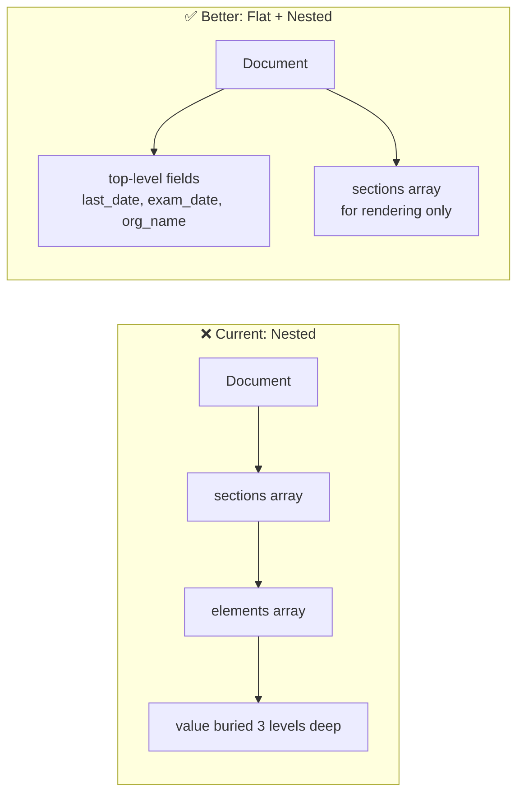

# 🗄️ Database Structure Analysis & Optimization Guide

> Based on live production data from `newsarkariresult.co.in` and source code analysis

---

## 🚨 CRITICAL: MongoDB Realm App Services Has Reached EOL

> [!CAUTION]
> Direct calls to the Realm API now return:
> ```json
> {"error": "Atlas App Services and Device Sync have reached EOL"}
> ```
> Your production site still works because the **deployed Netlify functions have the Realm SDK cached**, but this **will break** on your next deployment or when MongoDB fully shuts down the endpoints. **You must migrate to MongoDB Data API or a direct MongoDB driver (`mongodb` npm package) ASAP.**

---

## 1. How Data Is Currently Stored

### Document Schema (Reconstructed from Code + Live Data)

Each job post is stored as a **single MongoDB document** with this structure:

```json
{
  "_id": "ObjectId(...)",
  "unique_id": "uuid-string",
  "title": "UP Police SI, ASI PET / PST Admit Card 2025",
  "title_slug": "up-police-si-asi-pet-pst-admit-card-2025",
  "category": "admit-cards",
  "short_information": "UPPRPB has released PET / PST Admit Card...",
  "image_url": "https://i.ibb.co/...",
  "keywords": ["UP Police", "SI", "ASI", "Admit Card"],

  "show": {
    "new": true
  },

  "filters": {
    "exam_type": ["police"],
    "applicable_states": ["up"],
    "minimum_qualification": ["graduation"],
    "other_tags": []
  },

  "pendingForm": false,

  "sections": [
    {
      "id": "sec_1",
      "title": "Meta Details",
      "elements": [
        {
          "type": "field",
          "name": "name_of_post",
          "label": "Name of Post",
          "value": "UP Police SI, ASI",
          "fieldType": "text",
          "important": false
        },
        {
          "type": "field",
          "name": "name_of_organisation",
          "label": "Name of Organisation",
          "value": "Uttar Pradesh Police Recruitment & Promotion Board (UPPRPB)",
          "fieldType": "text"
        }
      ]
    },
    {
      "id": "sec_2",
      "title": "Important Dates",
      "elements": [
        {
          "type": "field",
          "name": "start_date",
          "label": "Application Start Date",
          "value": "07 January 2024",
          "fieldType": "text"
        },
        {
          "type": "field",
          "name": "last_date",
          "label": "Last Date",
          "value": "{red}31 January 2024{/red}",
          "fieldType": "text",
          "important": true
        },
        {
          "type": "field",
          "name": "exam_date",
          "label": "Exam Date",
          "value": "02 November 2025",
          "fieldType": "text"
        }
      ]
    },
    {
      "id": "sec_3",
      "title": "Application Fee",
      "elements": [
        {
          "type": "field",
          "name": "ur_ews_obc",
          "label": "UR/OBC",
          "value": "Rs. 400/-",
          "fieldType": "text"
        },
        {
          "type": "field",
          "name": "mode_of_payment",
          "label": "Mode of Payment",
          "value": "Debit Card\nCredit Card\nInternet Banking\nIMPS",
          "fieldType": "textarea"
        }
      ]
    },
    {
      "id": "sec_4",
      "title": "Age Limit",
      "elements": [
        { "type": "field", "name": "min_age", "label": "Minimum Age", "value": "18 Years" },
        { "type": "field", "name": "max_age", "label": "Maximum Age", "value": "28 Years" }
      ]
    },
    {
      "id": "sec_5",
      "title": "Vacancy Details",
      "elements": [
        {
          "type": "table",
          "name": "vacancy_table",
          "label": "Vacancy Table",
          "columns": ["Post Name", "Total", "Qualification"],
          "rows": [
            ["Sub-Inspector (Confidential)", "300", "Graduate, Typing, 'O' Level"],
            ["Asst Sub-Inspector (Clerk)", "421", "Graduate, Typing"],
            ["Asst Sub-Inspector (Accounts)", "200", "B.Com"]
          ]
        }
      ]
    },
    {
      "id": "sec_6",
      "title": "Important Links",
      "elements": [
        {
          "type": "field",
          "name": "download_admitcard",
          "label": "Download Admit Card",
          "value": "[Click Here](https://www.asimexams.com/...)",
          "fieldType": "text"
        },
        {
          "type": "field",
          "name": "official_website_link",
          "label": "Official Website",
          "value": "[Click Here](https://uppbpb.gov.in/Home/Notice)",
          "fieldType": "text"
        }
      ]
    }
  ],

  "inserted": "1710000000000",
  "updated": "1710100000000"
}
```

### Listing Documents (What APIs Return for Lists)

The listing APIs (`getAllRecords`, `getCategoryRecords`) return a **subset** of fields:

```json
{
  "list": [
    {
      "title": "UP Police SI, ASI PET / PST Admit Card 2025",
      "title_slug": "up-police-si-asi-pet-pst-admit-card-2025",
      "unique_id": "uuid-string",
      "category": "admit-cards",
      "short_information": "...",
      "show": { "new": true },
      "inserted": "1710000000000",
      "updated": "1710100000000"
    }
  ],
  "count": 150,
  "index": 1,
  "items": 25
}
```

---

## 2. Problems with Current Database Design

### Problem 1: Everything is in `sections[].elements[]` — No Queryable Top-Level Fields



| What You Can't Do Currently | Why |
|---|---|
| **Query "all jobs with exam_date in next 30 days"** | `exam_date` is buried inside `sections[1].elements[5].value` — MongoDB can't efficiently index this |
| **Sort jobs by application deadline** | `last_date` is a string like "31 January 2024" inside a nested element, not a proper Date type |
| **Find all jobs by organisation** | `name_of_organisation` is inside Meta Details section elements, not a top-level field |
| **Search by total vacancies** | Total post count is inside a table element, not queryable |

### Problem 2: Dates Stored as Display Strings, Not ISO Dates

```
Current:  "value": "07 January 2024"         ← String, not queryable  
Current:  "value": "{red}31 January 2024{/red}" ← String WITH styling tags!
Better:   "last_date": "2024-01-31T00:00:00Z"  ← ISO Date, indexable + queryable
```

### Problem 3: Styling Tags Mixed with Data

Values contain display-layer formatting like `{red}...{/red}` and `{bgYellow}...{/bgYellow}`. This **violates separation of concerns** — the database should store clean data, and the UI should decide how to style it.

### Problem 4: Links Stored as Markdown in Text Fields

```
Current:  "value": "[Click Here](https://uppbpb.gov.in/...)"
Better:   "value": { "text": "Click Here", "url": "https://uppbpb.gov.in/..." }
```

### Problem 5: No Field Projections in Realm Functions

The listing APIs likely return **entire documents** when they only need `title`, `title_slug`, `show`, and `category`. Each full document could be 5-20KB, while a listing item should be ~200 bytes.

### Problem 6: `inserted`/`updated` as Millisecond Strings Instead of Dates

```
Current:  "inserted": "1710000000000"  ← String!
Better:   "inserted": ISODate("2024-03-09T16:26:40Z")  ← MongoDB Date type
```

---

## 3. Recommended Database Redesign

### New Document Schema

```json
{
  "_id": "ObjectId(...)",
  "unique_id": "uuid-string",
  
  "title": "UP Police SI, ASI PET / PST Admit Card 2025",
  "title_slug": "up-police-si-asi-pet-pst-admit-card-2025",
  "category": "admit-cards",
  "short_information": "UPPRPB has released...",
  
  "organisation": "UPPRPB",
  "post_name": "UP Police SI, ASI",
  "total_posts": 921,
  
  "dates": {
    "application_start": "2024-01-07T00:00:00Z",
    "last_date": "2024-01-31T00:00:00Z",
    "exam_date": "2025-11-02T00:00:00Z",
    "admit_card_date": "2025-10-28T00:00:00Z",
    "result_date": "2025-12-10T00:00:00Z"
  },
  
  "filters": {
    "exam_type": ["police"],
    "applicable_states": ["up"],
    "minimum_qualification": ["graduation"],
    "other_tags": []
  },
  
  "show": { "new": true },
  "status": "published",
  "image_url": "https://i.ibb.co/...",
  "keywords": ["UP Police", "SI", "ASI"],
  
  "sections": [ /* ...same nested structure for RENDERING only... */ ],
  
  "inserted": "2024-03-09T16:26:40Z",
  "updated": "2025-12-30T10:00:00Z"
}
```

### Key Changes

| Change | Benefit |
|---|---|
| **Add `organisation`, `post_name`, `total_posts`** as top-level fields | Queryable, sortable, filterable without scanning nested arrays |
| **Add `dates` object** with proper ISO dates | Query upcoming exams, sort by deadline, show countdown timers |
| **Keep `sections[]` for rendering** | No change to how detail pages render, backward compatible |
| **Add `status`** field (`published`, `draft`, `archived`) | Replaces `pendingForm: true` hack, cleaner draft system |
| **Store `inserted`/`updated` as ISO strings** | Proper date sorting and range queries |
| **Remove styling tags from data** | Use the `important` boolean flag instead of `{red}...{/red}` |

### Required MongoDB Indexes

```javascript
// Essential indexes for your queries
db.records.createIndex({ "title_slug": 1 }, { unique: true })
db.records.createIndex({ "category": 1, "updated": -1 })
db.records.createIndex({ "status": 1, "category": 1 })
db.records.createIndex({ "filters.exam_type": 1 })
db.records.createIndex({ "filters.applicable_states": 1 })
db.records.createIndex({ "filters.minimum_qualification": 1 })
db.records.createIndex({ "dates.last_date": -1 })
db.records.createIndex({ "dates.exam_date": -1 })
db.records.createIndex({ "title": "text", "short_information": "text" })
```

---

## 4. Migration Strategy (Zero Downtime)

### Phase 1: Add Top-Level Fields (Non-Breaking)

Write a **migration script** that reads each document's `sections` and extracts key values into new top-level fields. The existing `sections` array remains untouched.

```javascript
// Pseudocode for migration script
for each document in records:
    metaSection = document.sections.find(s => s.title === "Meta Details")
    datesSection = document.sections.find(s => s.title === "Important Dates")
    
    update = {
        $set: {
            organisation: getElementValue(metaSection, "name_of_organisation"),
            post_name: getElementValue(metaSection, "name_of_post"),
            "dates.last_date": parseDate(getElementValue(datesSection, "last_date")),
            "dates.exam_date": parseDate(getElementValue(datesSection, "exam_date")),
            status: document.pendingForm ? "draft" : "published"
        }
    }
```

### Phase 2: Update Realm Functions → Use Projections

```javascript
// Current (bad): returns entire document for listing
db.records.find({ category: "latest-jobs" })

// Better: return only needed fields
db.records.find(
    { category: "latest-jobs", status: "published" },
    { projection: { title: 1, title_slug: 1, show: 1, short_information: 1, updated: 1 } }
).sort({ updated: -1 }).limit(25)
```

### Phase 3: Migrate from Realm to Direct MongoDB

Replace `mongo-app.js` (Realm App Services) with a direct MongoDB driver connection:

```javascript
// New: lib/mongodb.js
import { MongoClient } from 'mongodb';

const client = new MongoClient(process.env.MONGODB_URI);
const db = client.db('newsarkariresult');

export async function getRecordBySlug(slug) {
    return db.collection('records').findOne({ title_slug: slug });
}

export async function getCategoryRecords(category, page, limit) {
    return db.collection('records')
        .find({ category, status: 'published' })
        .project({ title: 1, title_slug: 1, show: 1, updated: 1 })
        .sort({ updated: -1 })
        .skip((page - 1) * limit)
        .limit(limit)
        .toArray();
}
```

> [!IMPORTANT]
> This migration is **not optional** — Realm App Services has reached EOL. You need to migrate to the `mongodb` npm package with a direct connection string from Atlas. I can help you implement this.

---

## 5. Impact Summary

| Metric | Current | After Optimization |
|---|---|---|
| **Listing query payload** | ~5-20 KB per record (full document) | ~200 bytes per record (projected) |
| **Query capability** | Title/category only | Date ranges, org, qualification, vacancy count |
| **Sort options** | Inserted date only | Any date field, vacancy count, relevance |
| **Search** | Basic regex (slow) | Atlas Search / text index (fast) |
| **Backend stability** | ⚠️ Realm EOL (will break) | ✅ Direct MongoDB driver (stable) |
| **Home page API calls** | 12+ separate calls | 1 consolidated call |
